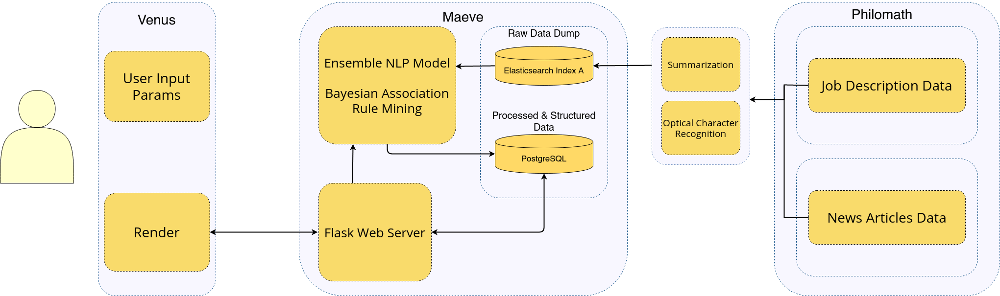

<p align="center">
  
</p>

# Team RASP - Project Joopiter

Visit our website at: [https://rasp.team](https://rasp.team).

<!-- TABLE OF CONTENTS -->
## Table of Contents

* [About RASP](#about-rasp)
  * [Built With](#built-with)
* [Pipeline](#pipeline)
* [Getting Started](#getting-started)
  * [Prerequisites](#prerequisites)
  * [Installation](#installation)
* [Usage](#usage)

<!-- ABOUT THE PROJECT -->
## About RASP
Our solution basically uses historical job data for information about the location, salary and requirements and News articles that provide information about the future (ie. predictions).

We decided the best way to work was to split our team into 3 divisions:
  * **Philomath** - Data acquisition division
  * **Venus** - Front-end division
  * **Maeve** - Big Data & ML analysis division

For detailed explanation about Project Joopiter, you can read [this](https://icecereal.github.io/blog/we-won-the-smart-india-hackathon/) blog article.

### Built With
Major frameworks that we used to build our project:
* [Flask](https://flask.palletsprojects.com/en/1.1.x/)
* [Elasticsearch](https://www.elastic.co/)
* [PostgreSQL](https://www.postgresql.org/)

## Pipeline

<p align="center">
  
</p>

<!-- GETTING STARTED -->
## Getting Started

Here are the instructions on how to set up our project locally.
To get a local copy up and running follow these simple example steps.

### Prerequisites

A list softwares, libraries etc. that you will need:
* Python3.5 or newer
* Elasticsearch
* PostgreSQL

### Installation

1. Clone the repo
```sh
git clone https://github.com/akos28/NC_GEU_MK105_RASP.git
```

## Usage
