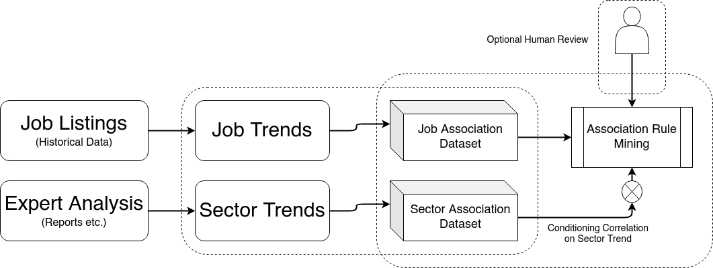

# Maeve - ES & PS Workers

<!-- TABLE OF CONTENTS -->
## Table of Contents

* [About Pipeline](#about-pipeline)
* [About ES & PS Workers](#about-workers)
* [Usage](#usage)
* [Wrappers](#wrappers)

## About Pipeline

<p align="center">
  
</p>

<!-- ABOUT THE PROJECT -->
## About Workers

We have divided the backend database and machine learning tasks into two workers:
* ES worker: reponsible for processing the data collected by the Philomath team using Natural Language Processing (NLP) techniques. In the case of pdf documents that are collected by the scrappers, we use Optical Character Recognition (OCR) methods to extract ASCII information. Additionally, a summarization procedure using TextRank is used to extract relavant information.
* PS worker: responsible for querying the Elasticsearch server, use the knowledgeDB to collect job position and sector trends and generate the Job Web using Apriori algorithm.

## Usage

To learn more on how to run, use:

```python
$ python es_worker -h
```

and likewise:

```python
$ python ps_worker -h
```

## Wrappers

We developed many wrappers to ease our development work. They can be found under the `utils` folder and are described below:
* `es_wrapper.py`: A wrapper around the `elasticsearch` python library to create documents and search based on our custom indices, document type and content structure.
* `ps_wrapper.py`: A wrapper around the `psycopg2` python library to update and modify the PostgreSQL database tables based on the custom schema that we are using.
* `nlp_wrapper.py`: A wrapper around the `ntlk` and other python libraries to quickly parse and summarize the text dump.
* `ocr_wrapper.py`: A wrapper around the `tesseract` python library to quickly use OCR methods to extract text from pdf documents.